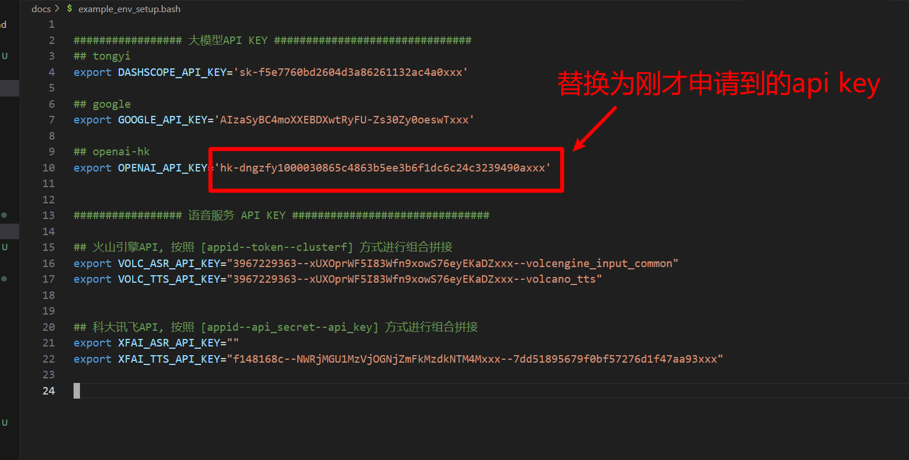

# openai-hk 中转平台api key申请说明

## 步骤如下:

### 1. 打开网站

### [openai-hk](https://www.openai-hk.com/v3/ai) 

### 2. 登录

使用微信关注公众号，或者Github登录

### 3. 获取 api key

有一元免费额度，调用gpt-3.5-turbo可以用较长时间，gpt-4o则消耗比较快。

## 4. 将api key写入env_steup.bash文件

用编解器打开刚才从 docs目录下拷贝出的，env_steup.bash 文件（注意是env_steup.bash文件）

如图所示，将刚才复制的api key 写入到 openai-hk对应的选项即可

