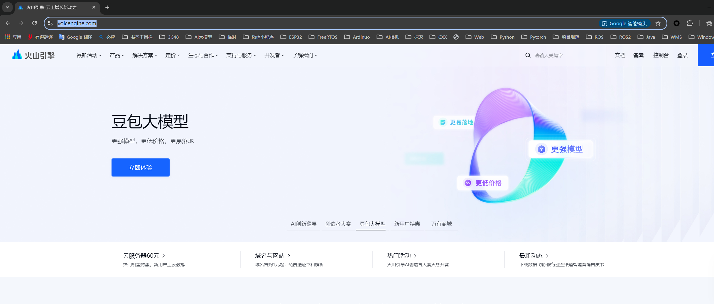
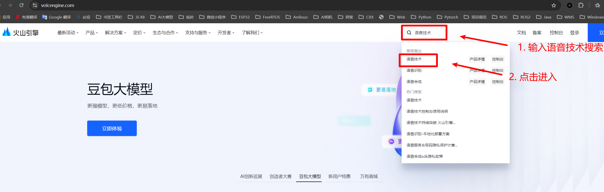
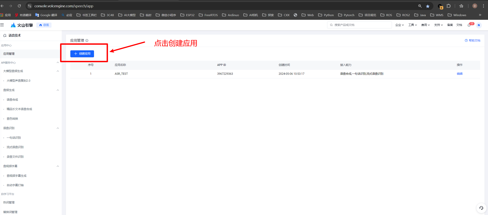
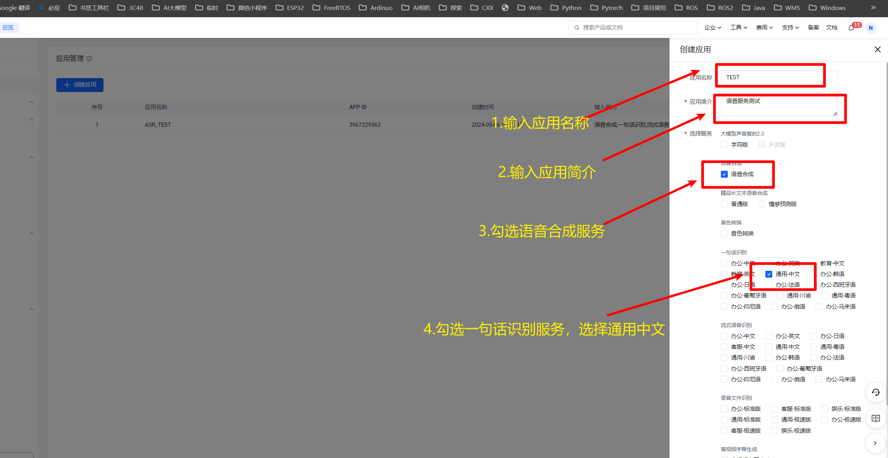
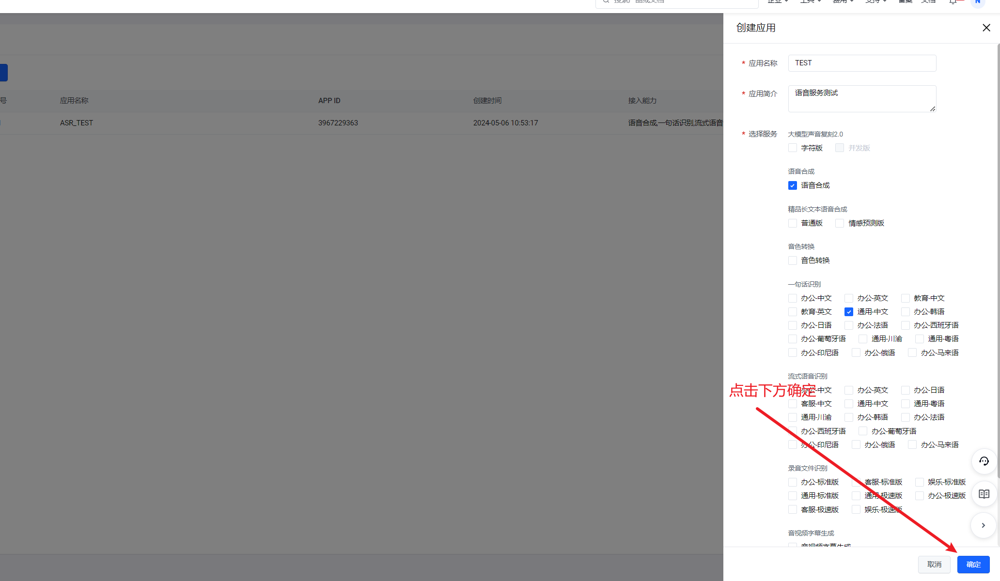
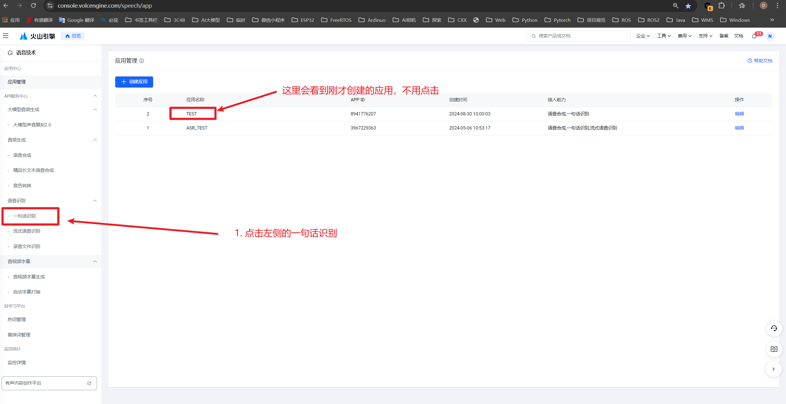
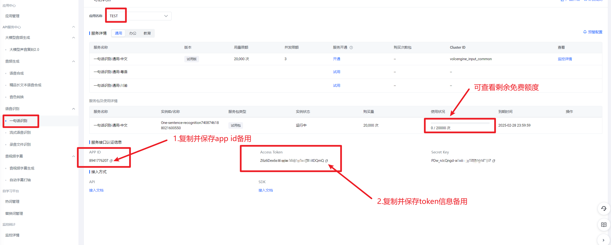
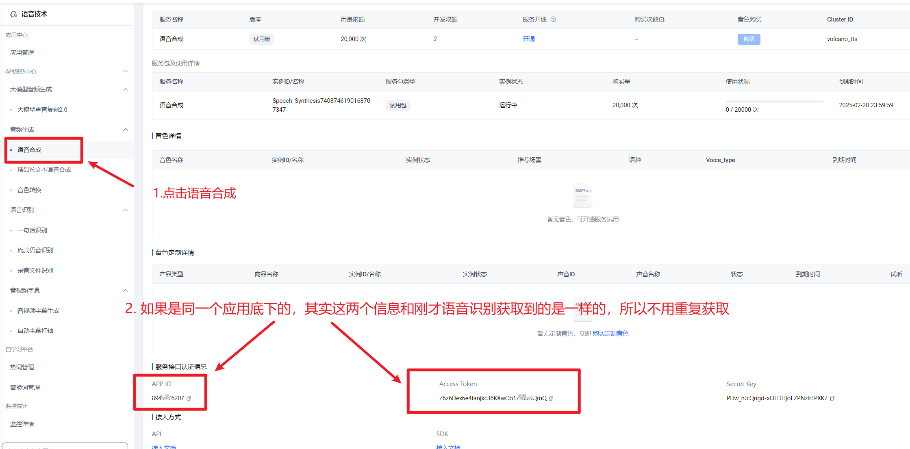
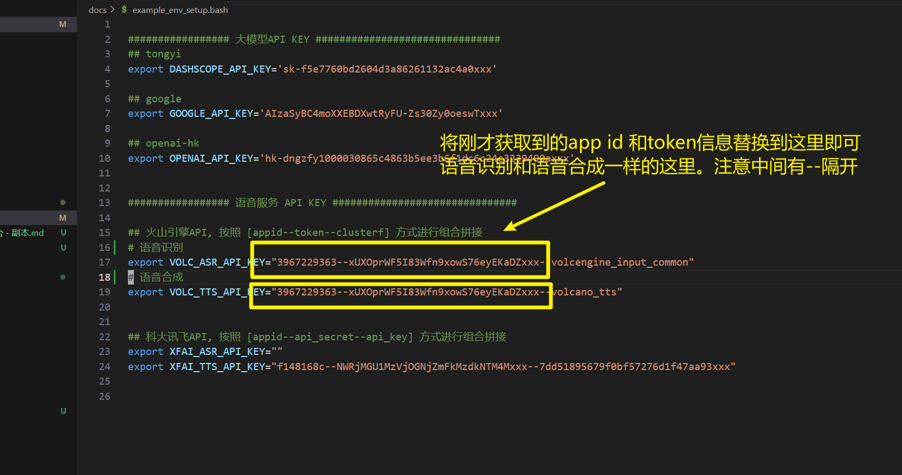

# 火山引擎api key申请说明

## 步骤如下:

### 1. 打开网站

### [火山引擎官网](https://www.volcengine.com/) 

### 2. 搜索进入语音技术后台

## 3.创建语音应用

​	注册账户登录成功后以同样的方式进入语音技术的申请界面，并点击创建应用。第一次使用可能会弹出实名验证窗口，按操作认证成功就好。实名验证完毕，就可以继续进行语音应用创建。

## 3.获取语音识别和语音合成的api key信息

上一步点确定后，后进入下面界面，可以看到刚刚创建的TEST应用，此时就可以在左侧栏选择进入相应的选项，复制并保存api key信息，可以先提前打开 env_steup.bash 文件，或者保存到其它地方再复制过去。

#### 3.1  语音识别

###  3.2 语音合成

​	语音识别的信息获取保存完毕后，现在获取语音合成的信息并保存，点击左侧栏的语音合成，注意，如果是同一个应用底下的服务，app_id和token其实是一样的，也就是说这里不用重复获取。

## 4. 将api key写入env_steup.bash文件

用编解器打开刚才从 docs目录下拷贝出的，env_steup.bash 文件

如图所示，将刚才保存的app id和 token信息，写入到火山引擎对应的选项即可。

